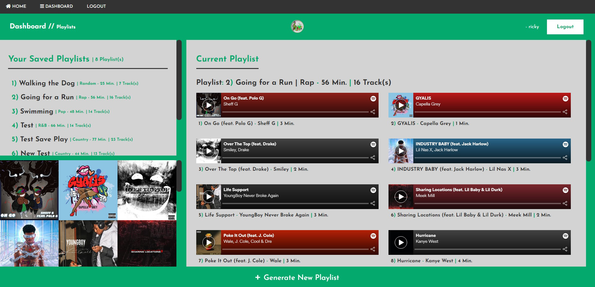

# Tune Time

  

  ### An App that generates playlists based on desired duration to accompany your daily activities.

  ## Steps
  ### Make a Playlist based on your desired duration or activity.
  
  ### Keep Generating Lists until you see some tracks you like, then hit save!
  
  ### Listen to, Explore, or View your Saved Lists in the Dashboard.
  

  ## Table of Contents  
  * [Steps](#steps)
  * [Installation](#installation)
  * [Usage](#usage) 
  * [Contributors](#contributors)
  * [Contributions](#contributions)
  * [Licensing](#licensing)
  * [Questions](#questions)

  ## Installation
  #### Click here -> [https://tune-time.herokuapp.com/](https://tune-time.herokuapp.com/)
  
  ## Usage
  #### Follow the steps from the [Screenshots Above](#steps)

  ## Contributors
  #### The Contributors of this Application: Rakib Ahmed, Alexander Davis, Darrell Carter, Brandon Sorrell, Daniel Quigley.

  ## Contributions
  #### To contribute to this application, you can: Fork it, Clone it, or Branch it!

  ## Licensing
  
  #### 
        MIT License

        Copyright (C) 2012-2020 by various contributors (see AUTHORS)

        Permission is hereby granted, free of charge, to any person obtaining a copy
        of this software and associated documentation files (the "Software"), to deal
        in the Software without restriction, including without limitation the rights
        to use, copy, modify, merge, publish, distribute, sublicense, and/or sell
        copies of the Software, and to permit persons to whom the Software is
        furnished to do so, subject to the following conditions:

        The above copyright notice and this permission notice shall be included in
        all copies or substantial portions of the Software.

        THE SOFTWARE IS PROVIDED "AS IS", WITHOUT WARRANTY OF ANY KIND, EXPRESS OR
        IMPLIED, INCLUDING BUT NOT LIMITED TO THE WARRANTIES OF MERCHANTABILITY,
        FITNESS FOR A PARTICULAR PURPOSE AND NONINFRINGEMENT. IN NO EVENT SHALL THE
        AUTHORS OR COPYRIGHT HOLDERS BE LIABLE FOR ANY CLAIM, DAMAGES OR OTHER
        LIABILITY, WHETHER IN AN ACTION OF CONTRACT, TORT OR OTHERWISE, ARISING FROM,
        OUT OF OR IN CONNECTION WITH THE SOFTWARE OR THE USE OR OTHER DEALINGS IN
        THE SOFTWARE.
        
        Copyright 1998 by the Massachusetts Institute of Technology.

        Permission to use, copy, modify, and distribute this software and its
        documentation for any purpose and without fee is hereby granted, provided that
        the above copyright notice appear in all copies and that both that copyright
        notice and this permission notice appear in supporting documentation, and that
        the name of M.I.T. not be used in advertising or publicity pertaining to
        distribution of the software without specific, written prior permission.
        M.I.T. makes no representations about the suitability of this software for any
        purpose.  It is provided "as is" without express or implied warranty.
  #### https://opensource.org/licenses/MIT
  
  ## Questions
  #### GitHub Profile: [*d4nnyq88*](https://github.com/d4nnyq88)
  #### Contact me or ask me questions at [danny.quigley88@gmail.com](mailto:danny.quigley88@gmail.com).
  